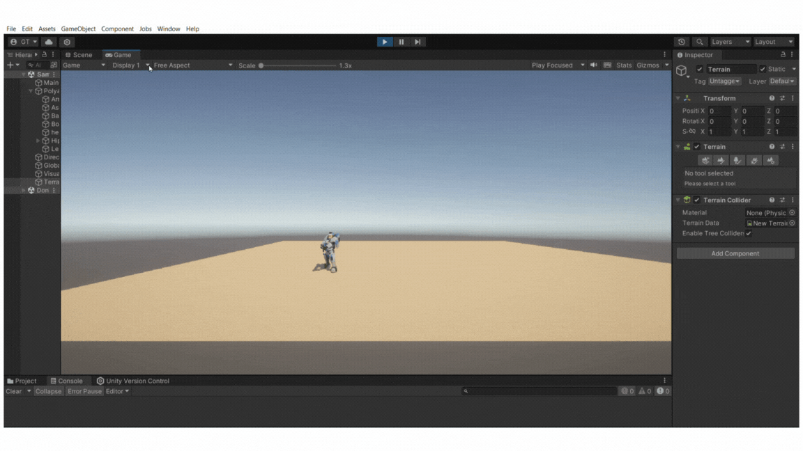
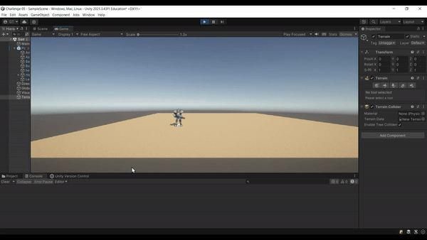
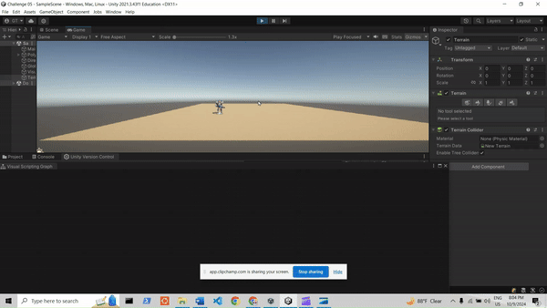
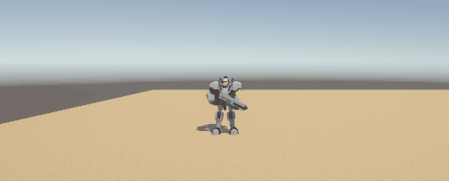

# Challenge 5: Go Ahead and Jump!

<h2>Preparando las herramientas necesarias.</h2>

Configuramos inicialmente el sistema nuevo de entradas de Unity.

<image
  src="Challenge05/newInput1.png"
  width = 60%
  height = 60%>

Luego, dentro de <code>Window -> Package Manager</code> instalamos el <code>Input System</code>. Vea la imagen a continuación de apoyo.

<image
  src="Challenge05/newInput2.png"
  width = 60%
  height = 60%>

Para poder darle movimiento a algún elemento buscamos en el Asset Store el paquete de Assets que usaremos y una vez lo elegimos lo descargamos en la misma opción de <code>Package Manager</code>.

<image
  src="Challenge05/importRobot.png"
  width = 60%
  height = 60%>

<h2>Añadimos terreno</h2>

Utilizando <code>Game 3D Object</code> creamos un <code>Terrain</code>. Configuramos su ancho, alto y largo en 50.

<image
  src="Challenge05/terrainSet.png"
  width = 30%
  height = 30%>

Buscamos cualquier textura que quisieramos para el terreno. 

<image
  src="Challenge05/textura.png"
  width = 30%
  height = 30%>

  

Le añadimos la textura al terreno.

<image
  src="Challenge05/addTexture.png"
  width = 60%
  height = 60%>

Ponemos un asset del packete que importamos encima del terreno.

<image
  src="Challenge05/putRobot.png"
  width = 60%
  height = 60%>

<h2>Comenzamos a configurar las acciones.</h2>

En el robot o seleccionamos <code>Add component</code> buscamos <code>Input player</code>.

<image
  src="Challenge05/addPlayerInputComp.png"
  width = 40%
  height = 40%>
  

Al haber realizados los pasos anteriores le aparecerá un icono como el de la siguiente imagen dentro de su carpeta de <code>Assets</code>.

<image
  src="Challenge05/newInput3.png"
  width = 60%
  height = 60%>

<h3>Creando acción de <code>Horizontal Movement</code></h3>

Al presionar el icono aparecerán varias acciones que unity tiene ya definidas, pero que como no las usaremos podemos eliminarlas y crear las nuestras desde cero o adaptar las prehechas. Para crear una acción referente a <code>Horizontal Movement</code> tenemos que presionar el botón de <code>+</code> y elegir el nombre de nuestra acción. En este caso se llamará <code>HorizontalMovement</code>. Esta es una acción tipo <code>Value</code> con un Control type de <code>Vector 2</code>.

<image
  src="Challenge05/horizontalMovementAction.png"
  width = 60%
  height = 60%>

Dentro de la acción tenemos que determinar que teclas son las que activan dicha acción. En este caso de <code>HorizontalMovement</code> las teclas que activan esta acción son <code>A</code>, <code>D</code>, <code>Left arrow</code> y <code>Right arrow</code>. El conjunto de estas teclas (en la imagen como "AD<-->") es de tipo <code>2D vector</code> mismo tipo que el Control type de la acción.

<image
  src="Challenge05/AD.png"
  width = 60%
  height = 60%>

  
En el siguiente GIF puede ver como al presionar <code>A</code> o <code>Left arrow</code> el robot se mueve hacia la izquierda y si se presionan  <code>D</code> o <code>Right arrow</code> el robot se mueve hacia la derecha. Importante notar que la velocidad con la que hace esto es una relativamente baja (ver valor en código proporcionado más adelante).

NOTA: Pudiera pasar que en algunos momentos se presenta poca fluidez en la grabación debido a problemas técnicos del equipo.

<h3>Creando acción de <code>Vertical Movement</code></h3>

<image
src="Challenge 5/step1.png"
width = 60%
height = 60%>

Similar a la creacion de <code>Horizontal Movement</code>, crearemos una accion referente a nuestro movimiento Vertical dandole click a <code>+</code> y nombrandolo VerticalMovement con un Control Type editado de Vector 2.

<image
src="Challenge 5/verticalA.png"
width = 60%
height = 60%>

Luego, crearemos un Composite para esta accion, esto es para poder decirle al juego cuales teclas reconocera como parte de nuestra accion: <code>+ > "Add Up/Down/Left/Right Composite</code>. Ya que tenemos nuestros composites, iremos donde los composites <code>Left y Right</code> y en la mano derecha tendremos una linea llamada <code>Path</code> y otra llamada <code>Composite Part</code>. Primero, vamos a: <code>Path > Up Arrow(Keyboard)</code> para decirle cual es la otra tecla que estara reconociendo para moverse hacia arriba y luego <code>Composite Part: Right > Composite Part : Up</code>. Luego, vamos a: <code>Path > Down Arrow(Keyboard)</code> para decirle cual es otra tecla que estara reconociendo para moverse abajo y luego <code>Composite Part: Left > Composite Part : Down</code>. Debe verse algo parecido a esto:

<image
src="Challenge 5/verticalM.png"
width=60%
height=60%>

<h3>Creando acción de <code>Fast Horizontal Movement</code></h3>

Ahora creamos la acción llamada <code>fastHorizontalMovement</code> que see basará en que cuando se presione <code>shift + A</code> o <code>shift + D</code> o <code>shift + left arrow</code> o <code>shift + right arrow</code> entonces la velocidad subirá a un valor determinado. Esta acción es de tipo <code>Button</code> pues solo queremos saber en que instantes se estan presionando las combinaciones de teclas antes mencionadas. 

<image
  src="Challenge05/fHori.png"
  width = 60%
  height = 60%>

En este caso las teclas que tenemos que configurar se basan en un <code>Modifier</code> que en esencia quiere decir que la acción solo va a ser activada si se presiona la tecla <code>modifier</code> y otra tecla escogida. En nuestro caso la tecla <code>modifier</code> es <code>shift</code>.

<image
  src="Challenge05/modifier.png"
  width = 60%
  height = 60%>

<image
  src="Challenge05/shift.png"
  width = 60%
  height = 60%>

Le añadimos un componenete que sea un <code>script</code> para poder decidir qué se va a realizar en cada acción. En nuestro caso lo llamamos <code>playerM</code>.

<image
  src="Challenge05/addPlayerM.png"
  width = 40%
  height = 40%>

NOTA: Pudiera pasar que en algunos momentos se presenta poca fluidez en la grabación debido a problemas técnicos del equipo.

<h3>Creando acción de <code>Fast Vertical Movement</code></h3>

Similar al <code>Fast Horizontal Movement</code>, crearemos una accion nueva: <code>+ > Button</code> y luego le vamos a decir que la velocidad cambiara cuando el jugador presione el boton <code>SHIFT + (W | S | UpArrow | DownArrow)</code>

<image
src="Challenge 5/fastVerticA.png"
width=60%
height=60%>

Luego, crearemos los composite de este action cual sera <code>fastVerticalMovement + >  Add Binding with One Modifier (x4)</code> y esto creara 4 composites con un binding . Para todos los composites, el modifier sera el mismo, <code>Shift</code> mientras que los bindings seran dos de movimiento vertical hacia alfrente y dos para el delantero <code>Binding > Path:W | UpArrow (Forward)</code> y <code>Binding > Path:S | DownArrow(Backwards)</code>.

<image
src="Challenge 5/fastVertic.png"
width=60%
height=60%>

<h3>Código en C#</h3>

Vea código que es pertinente para realizar las acciones <code>HorizontalMovement</code> y <code>FastHorizontalMovement</code>. Note que los metodos comienzan con <code>On</code> esto es para que se activen cuando la acción estó siendo llamada. Los métodos usualmente tienen en su nombre: <code>OnActionName</code>. 

<image
  src="Challenge05/horizontalScript.png"
  width = 60%
  height = 60%>

Terminando el codigo en C#, se le añade las funciones para movimiento vertical junto a las existentes horizontales:

<image
src="Challenge 5/code.png"
width=60%
height=60%>

<h3>Visual Graph</h3>

Para poder replicar lo que ya tenemos, pero con <code>Visual Graph</code> creamos un visual script y lo añadimos como componente del robot.

<image
  src="Challenge05/setVisual.png"
  width = 35%
  height = 35%>

<image
  src="Challenge05/visual.png"
  width = 60%
  height = 60%>

NOTA: Pudiera pasar que en algunos momentos se presenta poca fluidez en la grabación debido a problemas técnicos del equipo.

<h2>Añadiendo física al jugador</h2>

Para poder implementar el salto del jugador, tenemos que añadirle dos componentes nuevos para implementar su física: Un <code>Rigidbody</code> para que sea afectado por la gravedad y un <code>Capsule Collider</code> para evitar que traspase el suelo.

Damos clic al jugador en la escena y nos dirigimos hacia <code>Add Component</code>. De aquí añadimos los dos componentes y ajustamos sus parámetros como se muestra a continuación:

<image src="img/01body1.png" width=80% height=80%>
<image src="img/02body2.png" width=80% height=80%>

<h2>Añadiendo el evento de <code>Jump</code></h2>

Nos dirigimos hacia el <code>Player Input</code> que ya habíamos creado y hacemos un clic derecho para añadir una nueva acción. A esta acción la llamamos <code>Jump</code> y le asignamos la barra de "Space" en el teclado. El resultado se debe ver así:

<image src="img/03event1.png" width=80% height=80%>

<h2>Programando el comportamiento de <code>Jump</code> y <code>Look</code></h2>

Ahora, volvemos a dirigirnos hacia el jugador y le añadimos otro componente nuevo: un "script" al que llamaremos <code>PlayerJump</code>. Lo codificamos de la siguiente manera:

<image src="img/04script1.png" width=80% height=80%>
<image src="img/06script3.png" width=80% height=80%>

Ahora añadimos otro "script" para hacer que el jugador pueda girar con el "mouse". Lo llamamos <code>PlayerLook</code> y lo programamos así:

<image src="img/05script2.png" width=80% height=80%>
<image src="img/07script4.png" width=80% height=80%>

<h2><code>Jump</code> y <code>Look</code> en acción</h2>

NOTA: Pudiera pasar que en algunos momentos se presenta poca fluidez en la grabación debido a problemas técnicos del equipo.

<h2>Producto Final!<h2>

NOTA: Pudiera pasar que en algunos momentos se presenta poca fluidez en la grabación debido a problemas técnicos del equipo.

